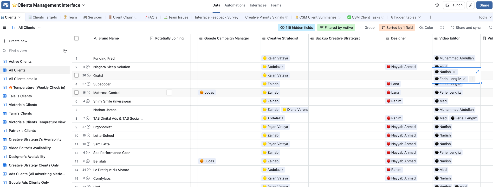
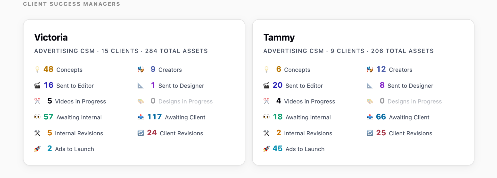

<!--
Source of truth for product intent.
Converted on 2026-09-16 from docs/prd-assets/PRD-v1-original.docx (C_PRD___TAS_Creative_Platform_v1.docx,
Talal Abulshamat, TAS Digital, 10 September 2026). Content is the author's; only formatting, hyperlinks and the
two embedded images were carried over. Do not edit the author's text here. Clarifications and decisions go in
docs/decisions.md. Section numbers below are the author's and are what tickets cite (e.g. "PRD §9").
-->

**PRD — TAS Creative Platform**
Version 1 — product requirements

| Prepared by | Talal Abulshamat, TAS Digital |
| --- | --- |
| For | Usama |
| Date | 10 September 2026 |
| Target | v1 usable by end of October 2026 (before Black Friday); fully off Airtable by end of 2026 |

**Contents**
1. What we’re building
2. Scope of v1
3. Brand onboarding
4. How the system actually works
5. Data model
6. AI-assisted data entry — v1 requirement
7. Naming conventions — must be automated
8. Delivery standard
9. The two approval tracks
10. Client interface
11. Roles, brands and access
12. Notifications
13. What must be better than Airtable
14. Migration
15. Phase 2 and beyond
16. How I’d like to work
17. Open questions for you
## 1. What we’re building
For now, A multi-brand creative strategy platform that replaces our Airtable Creative Hub.
It is the system our creative team works in and the system our clients log into to approve work. Nothing else in v1.
**Why we’re leaving Airtable:** ~$9–15k/year and rising with every new client and team member, and a change made in one client base has to be repeated by hand in every other base. It doesn’t survive us doubling or tripling our client count.
**The one sentence version:** rebuild the Airtable system described below — the connected tables our strategists fill in, the Concepts and Creative Briefs they produce, and the client interface where those get approved — as a proper multi-tenant app, with one shared template that propagates to every brand and Slack DMs instead of channel spam.
## 2. Scope of v1
**In scope — in this priority order:**
1. **The briefing system** — all the tables listed in §5, feeding Concepts and Creative Briefs, with the naming conventions automated. This is the priority. Airtable is our data collection and briefing system for us.
1. **The client interface** — a per-brand view where the client approves concepts, creatives, copy and creators, and leaves comments/annotations. Clients see only their own brand, and the pages and fields shown are configurable per client.
1. **The two-track approval system** — internal status (between our team) and client status (client-facing), kept separate.
1. **AI-assisted data entry** — see §6. Our strategists do their research and build personas and angles in Claude. Getting that into the platform must not mean typing records one at a time.
1. **Slack notifications** — similar to the automations on Airtable, which are notifications according to the status of the designs
1. **AI spell checker** — the one you already built for us, rebuilt here.
1. **Brand onboarding** — see §3.
1. **Migration** of existing Airtable data.
**Out of scope for v1** (I want most of these eventually — see §15): asset library / drive, mood boards, ad spy, creator ranking, performance tracker, Meta ad launcher, agency upload links, and the client onboarding questionnaire (§3).
## 3. Brand onboarding - Fillout (for the next versions)
Adding a new client should be filling in a short setup, not cloning and rewiring a template. What we need to capture:
- **Brand name** — becomes the workspace name in the top nav
- **Brand website** and any other brand links
- **Team assignment** — which creative strategist, video editor(s), designer(s), CSM and media buyer are on this brand
  - Each brand should have a Client Success Manager, Creative Strategist, a video editor, a designer and a Media buyer. Ex: CLient Management Interface Base > Clients Table

  - TAS Digital should be added in a team dashboard, with their role and names
- **Notification routing** (Slack, email notifications we can turn them ON or OFF)— derived from the team assignment, so we never rebuild automations by hand again (ignore UGC automations; only design automations on Airtable)
  - Channel notification and direct notification to the team responsible
- **Client users** — who gets access to the interface
- **Interface configuration** — which pages and fields this client sees (§10)
**Not needed in v1:** we send new clients a questionnaire through Fill Out (a third-party form tool wired into Airtable). The creative strategist just reads the answers to do their research — nothing downstream depends on it being in the system. Building forms natively would be nice later, but don’t spend v1 time on it.
## 4. How the system actually works
**Important, so this isn’t misread: it is not a linear flow for data entry.**
It should start that the creative strategist should add the prodcuts/landing pages , as in the Products table in Airtable, then the other tables in §5 are independent. The team fills them in whatever order suits the brand — a strategist might start from themes, or write angles before formalising the personas, they can also add products later. Nothing should force a sequence or block a table because an earlier one is empty.
What matters is that the information ends up in there, because** Concepts and Creative Briefs are assembled from it**. Those two are the output; everything else is the raw material.

What *is* sequential is approval:
A CS first will need to add Products info, then Personas, then Angles, then Themes (if they want to add any new theme) then Concepts.
An Angle is connected to a Persona.
A Concept is a collection of Batch + Angle + Theme, when a concept is added, it should be added like this: Batch & "-" & Angles & "-" & Themes

For reference, check this SOP: [https://tas-digital.notion.site/How-to-manage-TAS-Digital-Creative-Strategy-HUB-powered-by-Airtable-32cd9941000481f492c2f88a49bc71c4?pvs=74](https://tas-digital.notion.site/How-to-manage-TAS-Digital-Creative-Strategy-HUB-powered-by-Airtable-32cd9941000481f492c2f88a49bc71c4?pvs=74)

CONCEPT created (Angle + Theme)
↓
**CLIENT APPROVES CONCEPT  —  gate 1, in the interface**
↓
CREATIVE BRIEF written → production (editor / designer)
↓
**INTERNAL QA + APPROVAL  —  gate 2, our team only**
↓
**CLIENT APPROVES CREATIVE  —  gate 3, in the interface**
↓
Media buyer or client downloads, launches, marks as Launched

Creators (UGC) and copy run their own approval loops alongside, on the same two-track pattern.

## 5. Data model
The problem with Airtable is there is no a parent child bases.
Every table below is a global template between all brands,independently editable table, per-brand unless marked** global**.
Whenever we make a change in the parent base, it will be replicated.
Sometimes, we test an idea a child base, if it works, we then want to implement in the parent base.
Whenever we make a change in a child page, when we add it, it will give a** pop-up** if we want to duplicate it to other bases, request comes in to the ADMIN dashboard to approve everything.

You can use this Airtable Base as a reference:** TAS Digital Creative Hub Template version 5.1 (Check description for updates)** Along with a brand template** : 💤  Niagara Sleep Solutions**

**CSV Upload feature: make sure that there is an upload feature where the team can upload bulk data. Build downloadable CSV templates**
### 5.1  Product or Collection / Landing Page (adding this is required, at least the landing page link)
Product or Landing Page Name, Link.
**Optionally** links to Collections, Campaigns & Offers, Angles, Creative Briefs, Copywriting, UGC Management — the team links what’s useful, it isn’t required.
**5.3  Campaigns & Offers (PAUSE IT FOR NOW)**
All the ecomm offers/holidays should be added as a dropdown menu, but also the team can create a custom one if needed, such as Buy 2 get 1 free
Internal only — this one is** not** in the client interface.
### 5.4  Personas
The most detailed table we have. Built from research, then referenced by angles.
Persona Name, A Day in the Life, Demographic, Psychographic, Core Desires (Cashvertising), Emotional Triggers (Cashvertising), Pain Points (Cashvertising), Success Factors (Buyer Personas), Perceived Barriers (Buyer Personas), Stage of Market Awareness (Breakthrough Advertising), Buying Triggers (Breakthrough Advertising), Problem/Challenge (StoryBrand), Success/Transformation (StoryBrand), Trigger Words (Mindstates).
This is the table §6 matters most for — a strategist may have ten personas ready, and filling fourteen long fields ten times by hand is the single most painful thing in Airtable today.
### 5.5  Themes — GLOBAL LIBRARY
This is an important structural change from Airtable.
A theme is the creative vehicle — the *how*. Three kinds:
- **Frameworks** — Problem/Solution, Ideal Gift for X, POV: X vs Y, Fandom
- **Production styles** — Green Screen, UGC Mashup, Walkthrough Street Style, Yapper Style, Narrator’s Style, VO on B-Rolls, 1 Person 2 Characters
- **Seasonal / timely hooks** — Spring x Soccer, Holiday Gifting, World Cup
Fields: Theme Name, Reference Links (multiple — ad links, Atria boards, Foreplay links), Notes, Attachments.
**Requirement:** the theme library is shared across every brand in the platform. When a strategist invents a new theme for her client, it goes into the one central library and everyone can use it immediately. In Airtable each base has its own disconnected Themes table — that has to end.

### 5.6  Angles
Written by the creative strategist from research. Angle Name, Type (multi-select: Emotional / Functional / Identity / Critical), Persona (link), Product (link), Collection (link), Description (this is the hypothesis), Pain Points, USP, Formats to create (Static / Video / Carousel / Motion Graphic), Ad Inspo, Potential, Winning, Internal Notes, Client Notes.
### 5.7  Concepts
**A concept is the pairing of one Angle and one Theme.** That’s our definition and the whole system rests on it.
- Name —** auto-generated**, do not let anyone type it: Batch-Angle-Theme — e.g. B1-Less Pressure Means Less Pain-Educational Content
- Batch — B1…B20
- Angle (link) and Theme (link) — the two inputs to the name
- **Auto-filled from the linked Angle:** Description (hypothesis), Pain Points, USP, Persona, Product, Type
- Filled by the strategist: Category (New / Iteration), Concept Style (Filming / Editing / AI Concept), Formats to create, Hook examples, Script idea, Ad Inspo
- Approval Status —** client-facing**: Pending For Approval → Approved / Needs Revisions
- Production Status — internal: To Do (approved by client) → In Progress → Filming in Progress → Sent to Design → Done → Launched
- Client’s Comments
- Links to Creators (UGC) and Creative Briefs
**Requirement:** everything derivable from the Angle must auto-fill. In Airtable half of this is still manual because the automation broke and nobody fixed it — that’s exactly the class of problem I want gone.
### 5.8  UGC Management
Creators we hire, and the client approves them.
Core: Creator Name, Age (18-24…65+), Gender, Ethnicity, Creator’s Profile Pic, Creator’s Video Intro, Creator Link, Platform (Fiverr / Billo / Backstage / Insense / Direct Management), Concepts to film (link), Products (link), Internal Brief, Shipping Location, Tracking Number, Raw assets, Date of Management, Deadline for the request, Budget per 60sec video, Creator’s cost (USD).
Three status tracks:
- Internal Creator’s Status — Request → Pending for CS Approval → Revisions Needed → Approved
- Status (client-facing) — Pending For Approval → Approved / Revisions Needed / Disapproved / Due Shipment / Filming In Progress / Video Delivered
- Internal Assets Status — Pending for CS Approval → Revisions Needed → Approved
- (Client’s) Note or Comments — client writes here

**5.8.1  Partnership Ads Tracking, these fields are inside the UGC management Table (we want to choose if we want to add this to the client’s interface)**
For clients running partnership / whitelisted ads from the creator’s own handle. Needs its own client-facing list they can group and filter (we do this for Gratsi today - Check GRATSI client interface).
Creator Name, Instagram Username, For Partnership Ads? (Yes/No — the up-front qualifier), Partnership Activity (Active / Not Active / Ended), Date of Partnership Activation, Partnership Time Period (days) (30/60/90), Continue Working With?, Extension Time Period, Partnership Price per 30 days (separate from the content fee), Notes for Partnership ads, Facebook Profile for Partnership.
**Requirement:** automatic expiry alerts. Activation date + time period (+ extension) = the date permission lapses and the ad stops delivering. We run a manual 25-day Slack reminder on Gratsi today — build it in properly, for every brand.
### 5.10  Creative Briefs (which is called in our Airtable: Creative Sheet (Internal & Interface)
The heart of the system. One record per creative asset.
- Name —** auto-generated** (see §7)
- Concept (link) →** auto-fills** Batch, Angle, Persona, Product.** Optional** — see the note on statics in §8
- Source (TAS / Client), Funnel (TOF / Retargeting / All Funnels), Type (Video / Static / Carousel / Motion Image), Version (V1, V2… as a dropdown, not just text in the name)
- Priority — Static High (12h) / Static Average (24h) / Video High (24h) / Video Average (48h)
- Assignee — the editor or designer
- Brief to Design/Editing — rich text, the actual instructions
- Script / Ad Content — the copy/script
- Elements we are Testing — the hypothesis, so we can analyse it later
- Inspiration — rich text + images +** links**. Must accept a Meta Ad Library link, an Atria link, a YouTube/TikTok/IG link, or an uploaded file. Pasted video links should be pulled in and playable in the brief.
- Dimensions — defaults per format, editable (see §8)
- Platform — Meta / Google / TikTok / YouTube / Website
- Design File (upload) + Design Link URL
- QA: Video Editor QA, Graphic Designer QA, Creative Strategist QA checkboxes + QA Checklist Doc
- Spelling Feedback (AI-written) + Re-run AI Spell Checker
- Internal Status and Client Status — see §9
- Performance — Winning (ROAS/CPA goal) / High Potential to Iterate / Losing
- Links to Copywriting, Collections, Campaigns & Offers
### 5.11  Copywriting
Ad copy, written separately but tied to the creative. Keep this table lean — these are the fields we actually use:
- Copy # — auto-generated
- Creative — link.** This is the connection that matters.**
- Primary Copy — the text above the creative (~125 characters)
- Headline — ~40 characters
- News Feed / Link Description — ~27 characters
- CTA — Shop Now / Learn More / Get Offer / Get Directions / Visit Us / Download
- Status — Pending For Client Review → Edited By Client / Approved / Revisions Needed / Disapproved
- Client’s Comment
We have Funnel and Copy Type in Airtable —** drop both**, we don’t use them.

## 6. AI-assisted data entry — NOT REQUIRED for V1 - Replaced by CSV uploads
Our strategists do their research and build personas and angles in Claude. Then they have to get that into the platform, and today that means typing record after record into Airtable. It’s the biggest friction in the whole system, and it’s why some of our data ends up thinner than it should be.
At minimum, one of these — ideally more than one:
1. **An AI assistant inside the platform.** The strategist pastes their research, or a block of ten personas, talks to the assistant, and it creates the records with the right fields populated and the right links made.
1. **Bulk paste that works.** Airtable’s one redeeming feature here is that you can lay data out as a table and paste it straight in. If the assistant is too much for v1, give us a paste-a-table / import-a-CSV path per table that maps columns to fields.
1. **An MCP integration, if it’s feasible.** Expose the platform to Claude as an MCP server so a strategist can have Claude write personas, angles and concepts into the platform directly from where they already work. This is the version I’d most like — tell me whether it’s realistic.
This matters most for** Personas** and** Angles** (long, many fields, created in batches), then** Themes** and** Concepts**.

## 7. Naming conventions — must be automated
Nobody should ever type these by hand. Today they do, and they get them wrong.
**Concepts:** Batch-Angle-Theme
B2-I Want To Play With My Kid-Problem/Solution

**Creatives:** {FUNNEL}{FORMAT}{NUMBER}-BATCH#-CONCEPT NAME-VARIATION#-(PRODUCT/COLLECTION if needed)

| **Funnel** |  | **Format** |  |
| --- | --- | --- | --- |
| T | Top of funnel | V | Video |
| R | Retargeting | S | Static |
| A | All funnels | C | Carousel |
|  |  | M | Motion Image |

TV1-B1-AROUNDTHEWORLD-V1-SNACKBOX
AV1-B1-Less Pressure Means Less Pain-Educational Content-V1

*(the second: all funnels, video 1, batch 1, angle-theme concept, version 1)*
Optionally prefixed with source and creator name for filming concepts: TAS-TV1-B1-Problem/Solution-Screen Time Guilt Flip-V1.
The number increments per funnel+format combination within the brand.** Version is picked from a dropdown and written into the name automatically.**
## 8. Delivery standard
Per concept, our default is:
- **2 video variations:** Versions of the brief whether it is video, static, carousel, or motion is picked from a dropdown and written into the name automatically.
- Statics delivered** separately**
**Important:** statics don’t always belong to a concept. Sometimes they have their own concepts, sometimes they’re standalone. So a Creative Brief must be able to exist** without** a parent concept — don’t make that link mandatory.
Dimensions per video variation:** 4:5 or 1:1 (1080x1080)** — confirmed per client —** plus 9:16**. Statics: 1:1 and 9:16.
Full dimension sets are produced only *after* the client approves the first ad, so the platform should let us add dimension variants to an already-approved creative.

## 9. The two approval tracks
This is what makes us different from an in-house team, and it has to stay separate.
**Internal Status** (our team only, client never sees it):
Sent to Designer → Static Design in Progress
Sent to Video Editor → Video Editing in Progress → (On Hold)
→ Ad Submitted → Images Revisions / Videos Revisions
→ Revisions Submitted → Approved → LAUNCHED

Launched needs to exist on the internal track too, not only the client one — the media buyer sets it once the ad is live, and that’s how our team knows a creative is finished.
**Client Status** (only visible/actionable once we’ve internally approved):
Pending for Approval → Approved / Revisions Needed → Launched

A creative appears in the client’s interface** only** when Internal Status = Approved and Client Status = Pending for Approval. Same principle for concepts, copy and creators.
Clients must be able to annotate video and images directly (frame comments), attach files and paste links — the way they can today.
## 10. Client interface
One interface per brand. Client logs in and sees only their brand. Five pages, and the only fields they can change:
We also should have a PARENT Interface page and CHILD interface pages

| **Page** | **Client can edit** |
| --- | --- |
| 🧩 Concepts | Approval Status, Client’s Comments |
| 🎨 Creatives | Client Status, comments / annotations |
| ✍️ Copywriting | Status, Client’s Comment |
| 👥 UGC Management | Status, (Client’s) Note or Comments, Tracking Number |
| 🤝 Partnership Ads Tracking | view, group, filter |

**Requirement — the interface must be configurable per client, at two levels:**
1. **Which pages appear.** Not every client gets copywriting. Not every client runs partnership ads. We should switch pages on and off per brand at onboarding, and change it later.
1. **Which fields appear.** Some clients want the full script on a concept card, some don’t. Today we hack this base by base; it should be a setting.
Default fields on the concept card: Batch, Category, Concept name, Concept Style, Angle, Theme, Product, Description (hypothesis), Pain Points, USP, Persona, Hook examples.
## 11. Roles, brands and access
One platform, many brands. Brand switcher in the top nav; the brand name is the header of the workspace.

| **Role** | **Access** |
| --- | --- |
| **Admin** (me) | Everything, all brands |
| **Client Success Manager** | **All brands assigned to them** — they work across the whole client base |
| **Creative Strategist** | Only the brands assigned to them |
| **Video Editor / Designer** | Only the brands assigned to them |
| **Media Buyer** | Assigned brands. Needs to** download approved creatives, launch them, and set status to Launched** |
| **Client** | Their own brand’s interface only |

- Each person gets their own account. Our creative team currently shares one Airtable login purely to dodge seat costs — that ends, because per-seat cost is no longer the constraint.
- Clients get no access to internal data, internal statuses, briefs or anything financial.
- Creator costs, budgets and partnership prices are internal-only fields, never client-visible.
## 12. Notifications
Today automations post into Slack channels and it’s noise nobody reads.
**Requirement:** notifications go as** Slack direct messages to the assigned person**, through our existing TAS Bot app. Channel posts only where a group genuinely needs them.
Triggers:
- Brief assigned to an editor/designer → DM the assignee, with priority and deadline
- Revisions requested (internal) → DM the assignee
- Ad submitted → DM the creative strategist / CSM for QA
- Client approved a concept / creative / copy / creator → DM the CSM + strategist
- Client requested revisions → DM the CSM + strategist
- Creative approved internally and ready to launch → DM the media buyer
- Creator status changes → DM the UGC manager
- Partnership permission expiring in 5 days → DM the media buyer + CSM
Routing comes from the team assignment made at onboarding (§3) — filled once, never rebuilt by hand.

## 13. An overview dashboard
There should be an overview dashboard where each role can see their pending tasks or the clients they have, please refer to the [https://pipeline.tas-digital.ai/](https://pipeline.tas-digital.ai/) as an example, but ofcourse, in our system it will be per team member, as of what their assigned, and pending tasks.

For a CSM, they need to have a full overview

For Media Buyers, the formula is that , when there are approved creatives by a client AND the media is assigned to this client, then the media should see ADS TO LAUNCH.

This is also true for the client that is launching the ads themselves, the dashboard should show the ads to LAUNCH, or at least they should change the status to LAUNCHED when they launch them

## 14. What must be better than Airtable
These are the reasons for the project, not nice-to-haves:
1. **One template, propagated.** A change to the template updates every brand. No more editing every base by hand.
1. **Onboarding a new client is a form, not a base clone** (§3).
1. **Naming and inheritance actually automated** — concept names, creative names, angle→concept field inheritance.
1. **Global theme library** across all brands.
1. **Getting research into the system without retyping it** (§6).
1. **Cost.** Target ≈$500/year total running cost instead of $9–15k.
1. **An agency-wide dashboard** (later, but design for it): all brands in one view — what’s in the pipeline, workload per editor and designer, what’s pending client approval, what’s launched. We have a rough version today (“Pipeline TAS Digital”, built on Cloudflare, reading from Airtable) and it’s genuinely useful.
## 15. Migration
We need everything currently in Airtable moved across. Priority is the active client bases: concepts, angles, personas, themes, creative briefs with their attachments and links, copy, creators and partnership records, and their status history.
I’d like active clients working in the new platform in** October**, before Black Friday.
## 16. Phase 2 and beyond
Everything you showed me, I want. In rough order of value to us:
1. **Asset library** — our drive inside the platform. Uploads, upload links for creators and agencies (no login needed), and B-rolls stored once and reusable across briefs. When a strategist pastes a reference video link into a brief, it should be downloaded, stored, and available to pick from in the next brief.
1. **Performance tracker** — Meta metrics against our creatives, so we can answer “which angles, themes and personas are actually winning” and iterate on the winners.** Non-negotiable: a read-only Meta token, created by you, with no write permissions. I need certainty there’s no risk to our ad accounts.**
1. **Mood boards** — for concept ideation, with embeds from Meta Ad Library, Instagram, TikTok, YouTube, comments, history and PNG export.
1. **Ad spy** — competitor ad monitoring per brand.
1. **Creator ranking** — automated, driven by ad performance detection.
1. **Ad launcher** — one-click launch of approved creatives to Meta. Same safety bar as the tracker; happy to use a proven third-party tool rather than build it.
1. **Agency-wide dashboard** — see §13.7.
1. **Native client onboarding forms** — replacing Fill Out (§3).
## 16. How I’d like to work
Part-time engagement, starting Monday. Check-in every ~3 days: you show me what’s built, I give feedback in the call or in writing. Target v0 of the briefing system in 3–4 weeks, active clients migrated in October, fully off Airtable by end of 2026.
## 17. Open questions for you
1. Can we export everything out of Airtable cleanly, including attachments? What do you need from me to test that early?
1. **Is the MCP option in §6 realistic** — exposing the platform to Claude so strategists can write personas and angles into it directly? If not, what’s the best version of AI-assisted entry you can build in v1?
1. Per-client page and field visibility (§10) — a config screen per brand, or template presets we assign?
1. For the global theme library — any concern about all brands sharing one namespace, or should it be global with per-brand favourites?
1. Tech stack and hosting — you mentioned Cloudflare and Railway. Anything you need me to sign up for or pay for directly?
